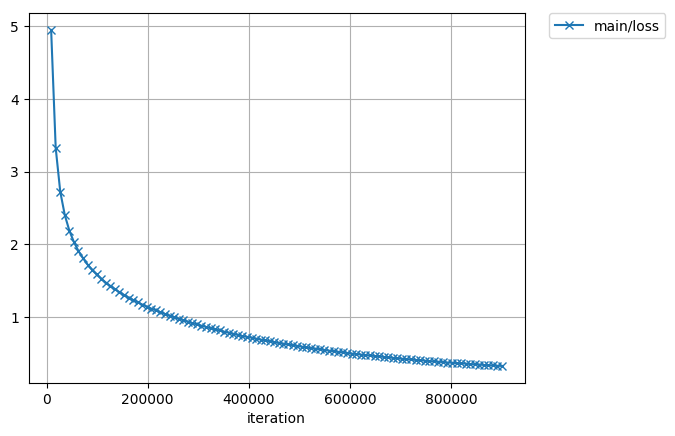
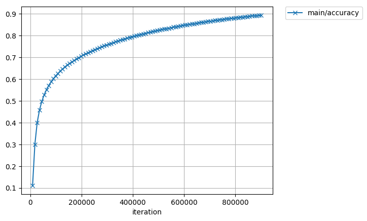

# MobileNet
[MobileNet](https://arxiv.org/abs/1704.04861)のChainer再現実装

学習
```
$ python3  python3 train_mobilenet_mn.py /dataset/imagenet/train.txt --mean /mnt/mobilenet/mean.npy --epoch 100 --batchsize 10 --gpu 0
```




動作環境:
- Python3x
- Chainer4.0

分散学習の場合:
- Docker
- ChainerMN